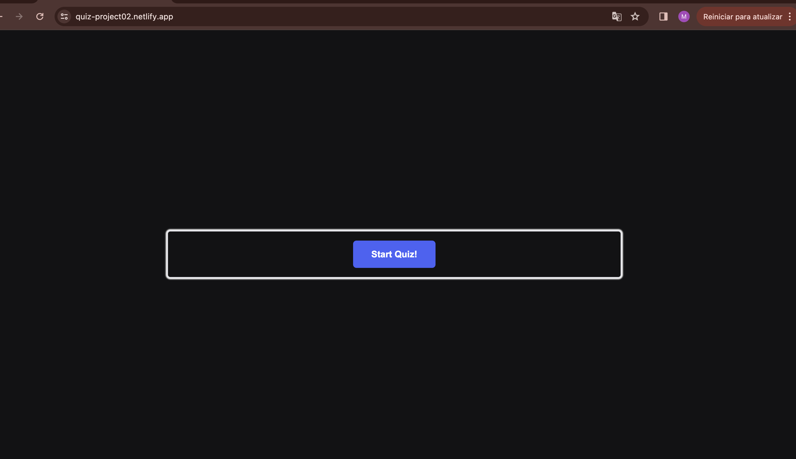
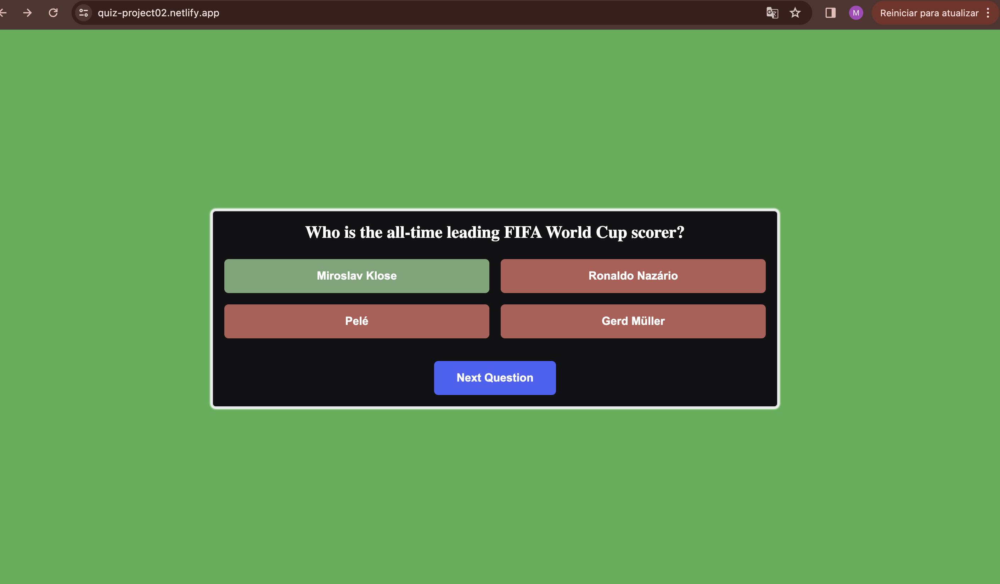
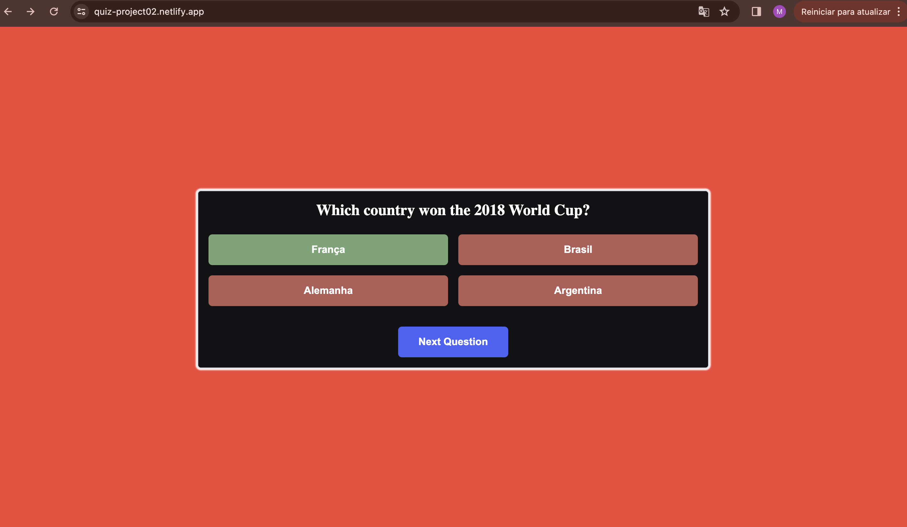
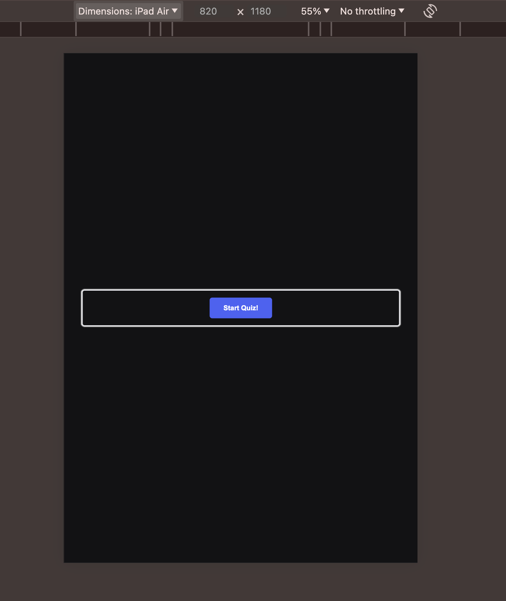
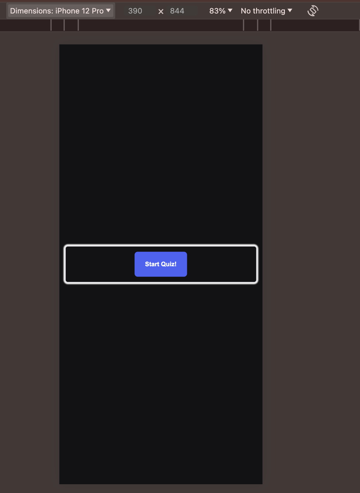
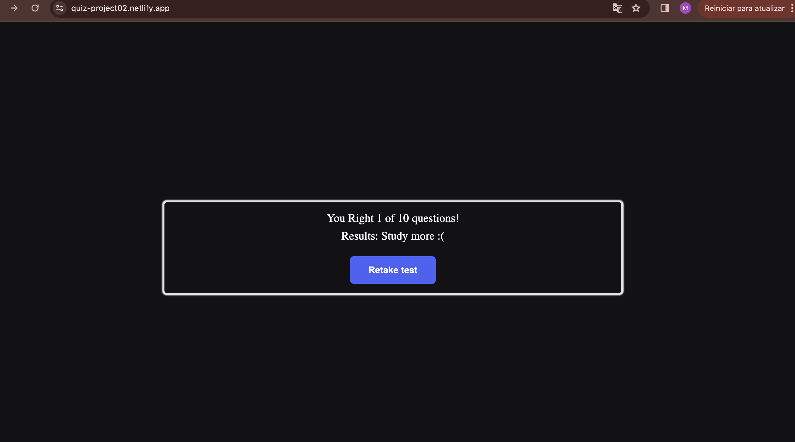
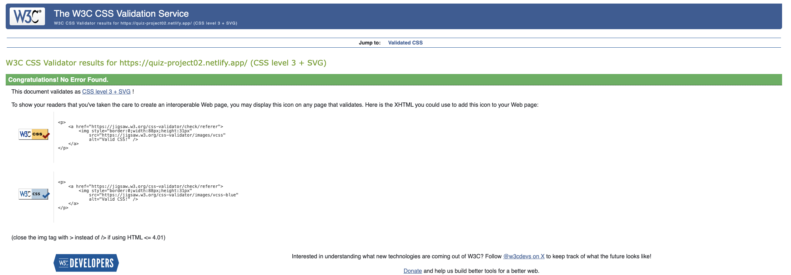
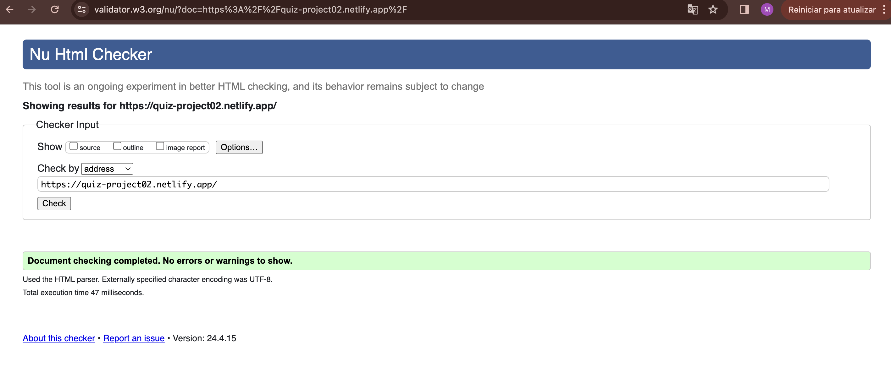
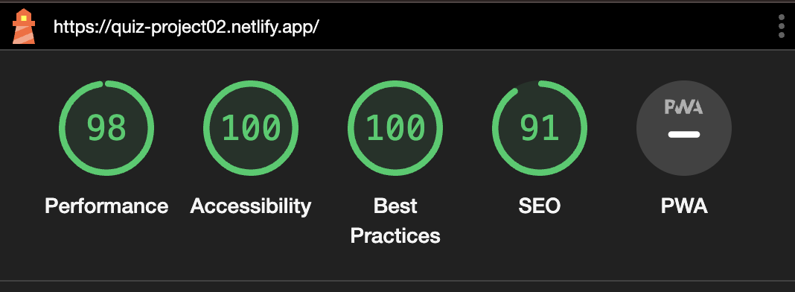
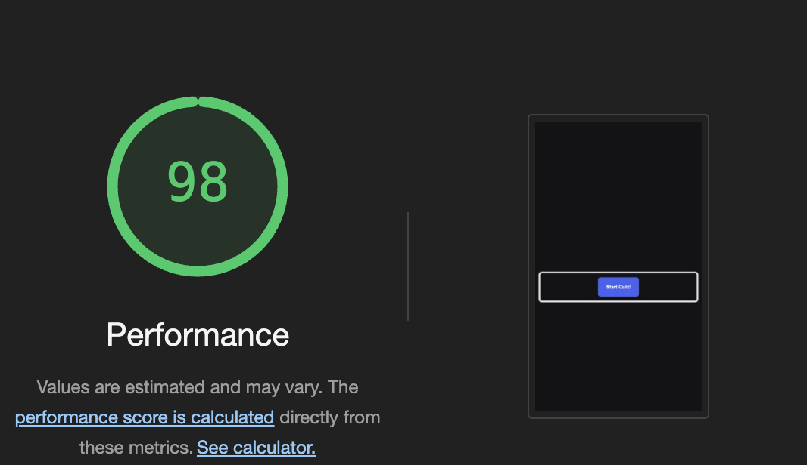

# Football Quiz

## Description
This project is an interactive football quiz that allows users to test and expand their knowledge about the most popular sport in the world. The quiz covers a variety of topics, including historical records, famous players, and significant events from football competitions.

## Technologies Used
- **HTML5**: For the basic structure of the quiz.
- **CSS3**: For styling and responsive layouts.
- **JavaScript**: For interactive quiz logic.

## File Structure
- `index.html`: The main page of the quiz.
- `style.css`: Contains all style rules for the quiz.
- `index.js`: Script responsible for the logic of presenting questions and collecting responses.

## Functionalities

- **Responsive Interface**: Designed to be accessible on devices of different sizes, from smartphones to desktops.
- **Immediate Feedback**: Users receive instant feedback after each answer, helping with the learning process.
- **Detailed Results**: At the end of the quiz, users can see their overall performance, with options to try again.
- **Pleasing Visual Aesthetics**: Clean and attractive user interface, using a color palette that is easy on the eyes.

###Images

Image:

## Quiz Questions

1. **Who is the all-time top scorer in FIFA World Cup history?**
   - Miroslav Klose (Correct)
   - Ronaldo Nazário
   - Pelé
   - Gerd Müller

2. **Which country won the 2018 FIFA World Cup?**
   - France (Correct)
   - Brazil
   - Germany
   - Argentina

3. **Which player has won the most Ballon d'Or awards?**
   - Lionel Messi (Correct)
   - Cristiano Ronaldo
   - Johan Cruyff
   - Michel Platini

4. **Which club has won the most UEFA Champions League titles?**
   - Real Madrid (Correct)
   - Milan
   - Liverpool
   - Barcelona

5. **Which player was the youngest to participate in a FIFA World Cup?**
   - Pelé
   - Norman Whiteside (Correct)
   - Samuel Eto'o
   - Michael Owen

6. **Which team won the first FIFA World Cup?**
   - Uruguay (Correct)
   - Brazil
   - Italy
   - Argentina

7. **Which player is known as 'El Pibe de Oro'?**
   - Diego Maradona (Correct)
   - Lionel Messi
   - Ronaldinho
   - Gabriel Batistuta

8. **Which player holds the record for the most goals in a single edition of the FIFA World Cup?**
   - Just Fontaine (Correct)
   - Ronaldo Nazário
   - Harry Kane
   - Miroslav Klose

9. **Which club is known as 'The Invincibles' in the English Premier League?**
   - Chelsea
   - Manchester United
   - Arsenal (Correct)
   - Liverpool

10. **Who was the captain of the Spanish national team that won the 2010 FIFA World Cup?**
    - Xavi Hernandez
    - Iker Casillas (Correct)
    - Sergio Ramos
    - Andres Iniesta

### Validator Testing:
Accessibility

I confirmed that the colours and fonts chosen are easy to read and accessible by running it through lighthouse in dev tools
[Link-Validator](https://validator.w3.org/)
[Link-Validator-css](https://jigsaw.w3.org/css-validator/)

